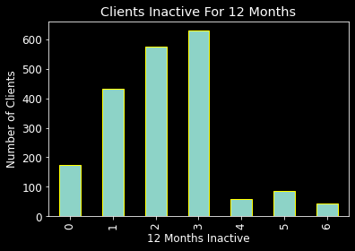

# Project Name : Bank Churners
### Importing necessary libraries


```python
import pandas as pd #allows importing data from various file formats such as comma-separated values, JSON, SQL, Microsoft Excel.
import matplotlib.pyplot as plt #To plot the data
```

### Reading BankChurners.csv file as bank_churners from the Data folder


```python
bank_churners= pd.read_csv('../Data/BankChurners.csv')
```

### Printing out first five rows from the file that we readed above


```python
bank_churners.head(5)
```


<div>
<style scoped>
    .dataframe tbody tr th:only-of-type {
        vertical-align: middle;
    }

    .dataframe tbody tr th {
        vertical-align: top;
    }

    .dataframe thead th {
        text-align: right;
    }
</style>
<table border="1" class="dataframe">
  <thead>
    <tr style="text-align: right;">
      <th></th>
      <th>CLIENT_NUM</th>
      <th>Attrition_Flag</th>
      <th>Customer_Age</th>
      <th>Gender</th>
      <th>Dependent_count</th>
      <th>Education_Level</th>
      <th>Marital_Status</th>
      <th>Income_Category</th>
      <th>Card_Category</th>
      <th>Months_on_book</th>
      <th>Total_Relationship_Count</th>
      <th>Months_Inactive_12_months</th>
      <th>Credit_Limit</th>
      <th>Total_Revolving_Bal</th>
      <th>Total_Trans_Amt</th>
    </tr>
  </thead>
  <tbody>
    <tr>
      <th>0</th>
      <td>768805383</td>
      <td>Existing Customer</td>
      <td>45</td>
      <td>M</td>
      <td>3</td>
      <td>High School</td>
      <td>Married</td>
      <td>$60K - $80K</td>
      <td>Blue</td>
      <td>39</td>
      <td>5</td>
      <td>1</td>
      <td>12691.0</td>
      <td>777</td>
      <td>1144</td>
    </tr>
    <tr>
      <th>1</th>
      <td>818770008</td>
      <td>Existing Customer</td>
      <td>49</td>
      <td>F</td>
      <td>5</td>
      <td>Graduate</td>
      <td>Single</td>
      <td>Less than $40K</td>
      <td>Blue</td>
      <td>44</td>
      <td>6</td>
      <td>1</td>
      <td>8256.0</td>
      <td>864</td>
      <td>1291</td>
    </tr>
    <tr>
      <th>2</th>
      <td>713982108</td>
      <td>Existing Customer</td>
      <td>51</td>
      <td>M</td>
      <td>3</td>
      <td>Graduate</td>
      <td>Married</td>
      <td>$80K - $120K</td>
      <td>Blue</td>
      <td>36</td>
      <td>4</td>
      <td>1</td>
      <td>3418.0</td>
      <td>0</td>
      <td>1887</td>
    </tr>
    <tr>
      <th>3</th>
      <td>769911858</td>
      <td>Existing Customer</td>
      <td>40</td>
      <td>F</td>
      <td>4</td>
      <td>High School</td>
      <td>Unknown</td>
      <td>Less than $40K</td>
      <td>Blue</td>
      <td>34</td>
      <td>3</td>
      <td>4</td>
      <td>3313.0</td>
      <td>2517</td>
      <td>1171</td>
    </tr>
    <tr>
      <th>4</th>
      <td>709106358</td>
      <td>Existing Customer</td>
      <td>40</td>
      <td>M</td>
      <td>3</td>
      <td>Uneducated</td>
      <td>Married</td>
      <td>$60K - $80K</td>
      <td>Blue</td>
      <td>21</td>
      <td>5</td>
      <td>1</td>
      <td>4716.0</td>
      <td>0</td>
      <td>816</td>
    </tr>
  </tbody>
</table>
</div>


### The datasheet contains 2000 rows and 15 columns


```python
bank_churners.shape
```


    (2000, 15)


### Columns of the datasheet


```python
bank_churners.columns
```


    Index(['CLIENT_NUM', 'Attrition_Flag', 'Customer_Age', 'Gender',
           'Dependent_count', 'Education_Level', 'Marital_Status',
           'Income_Category', 'Card_Category', 'Months_on_book',
           'Total_Relationship_Count', 'Months_Inactive_12_months', 'Credit_Limit',
           'Total_Revolving_Bal', 'Total_Trans_Amt'],
          dtype='object')


### Creating Methods in Object (details_of_each_column) for the columns.


```python
print("There are total",bank_churners['Attrition_Flag'].nunique(),"attrition flag of customers.","\n") # using nunique() funtion to return number of unique elements
print(bank_churners.Attrition_Flag.value_counts(),"\n") # using value_counts() function to get a Series containing counts of unique values
```

    There are total 2 attrition flag of customers. 
    
    Existing Customer    1830
    Attrited Customer     170
    Name: Attrition_Flag, dtype: int64 
    
    


```python
print(bank_churners.Credit_Limit.describe(),"\n") # using describe function, finding min and max value, and creating range
print("There are",(bank_churners.Credit_Limit < 10000.00).value_counts()[1], "clients with less than 10,000 credit limit.")
print("There are",((bank_churners.Credit_Limit > 10000.00) & (bank_churners.Credit_Limit < 20000.00)).value_counts()[1], "clients within (10,000 - 20,000) credit limit.")
print("There are",((bank_churners.Credit_Limit > 20000.00) & (bank_churners.Credit_Limit < 30000.00)).value_counts()[1], "clients within (20,000 - 30,000) credit limit.")
print("There are",(bank_churners.Credit_Limit > 30000.00).value_counts()[1], "clients with more than 30,000 credit limit.")
```

    count     2000.000000
    mean      9149.488950
    std       8871.524952
    min       1438.300000
    25%       2923.500000
    50%       5454.000000
    75%      12160.000000
    max      34516.000000
    Name: Credit_Limit, dtype: float64 
    
    There are 1393 clients with less than 10,000 credit limit.
    There are 349 clients within (10,000 - 20,000) credit limit.
    There are 137 clients within (20,000 - 30,000) credit limit.
    There are 121 clients with more than 30,000 credit limit.
    

###### Repeating the same steps above for the columns and  created methods in object.


```python
class details_of_each_column: # except column CLIENT_NUM
    
    def Attrition_Flag():
        print("There are total",bank_churners['Attrition_Flag'].nunique(),"attrition flag of customers.","\n")
        print(bank_churners.Attrition_Flag.value_counts(),"\n")
        
    def Customer_Age():
        print(bank_churners.Customer_Age.describe(),"\n")
        print("There are",(bank_churners.Customer_Age < 30).value_counts()[1], "clients with less than age of 30.")
        print("There are",((bank_churners.Customer_Age > 30)&(bank_churners.Customer_Age < 40)).value_counts()[1], "clients within (30 - 40) of age.")
        print("There are",((bank_churners.Customer_Age > 40)&(bank_churners.Customer_Age < 50)).value_counts()[1], "clients within (40 - 50) of age.")
        print("There are",((bank_churners.Customer_Age > 50)&(bank_churners.Customer_Age < 60)).value_counts()[1], "clients within (50 - 60) of age.")
        print("There are",((bank_churners.Customer_Age > 60)&(bank_churners.Customer_Age < 70)).value_counts()[1], "clients within (60 - 70) of age.")
        print("There are",(bank_churners.Customer_Age > 70).value_counts()[1], "clients with more than age of 70.")
        
    def Gender():
        print("There are total",bank_churners['Gender'].nunique(),"genders.","\n")
        print(bank_churners.Gender.value_counts(),"\n")
        
    def Dependent_count():
        print("There are total",bank_churners['Dependent_count'].nunique(),"dependent count of clients.","\n")
        print(bank_churners.Dependent_count.value_counts(sort=False),"\n")
        
    def Education_Level():
        print("There are total",bank_churners['Education_Level'].nunique(),"education level of clients.","\n")
        print(bank_churners.Education_Level.value_counts(),"\n")
    
    def Marital_Status():
        print("There are total",bank_churners['Marital_Status'].nunique(),"marital status of clients.","\n")
        print(bank_churners.Marital_Status.value_counts(),"\n")
        
    def Income_Category():
        print("There are total",bank_churners['Income_Category'].nunique(),"categories of income.","\n")
        print(bank_churners.Income_Category.value_counts(),"\n")
    
    def Card_Category():
        print("There are total",bank_churners['Card_Category'].nunique(),"types of card.","\n")
        print(bank_churners.Card_Category.value_counts(),"\n")
        
    def Months_on_book():
        print(bank_churners.Months_on_book.describe(),"\n")
        print("There are",(bank_churners.Months_on_book < 20).value_counts()[1], "clients with less than 20 months on book.")
        print("There are",((bank_churners.Months_on_book > 20)&(bank_churners.Months_on_book < 40)).value_counts()[1], "clients within (20 - 40) months on book.")
        print("There are",(bank_churners.Months_on_book > 40).value_counts()[1], "clients with more than 40 months on book.")
        
    def Total_Relationship_Count():
        print("There are total",bank_churners['Total_Relationship_Count'].nunique(),"relationship count of clients.","\n")
        print(bank_churners.Total_Relationship_Count.value_counts(sort=False),"\n")
    
    def Months_Inactive_12_months():
        print("There are total",bank_churners['Months_Inactive_12_months'].nunique(),"(inactive status for 12 months) of clients.","\n")
        print(bank_churners.Months_Inactive_12_months.value_counts(sort=False),"\n")
    
    def Credit_Limit():
        print(bank_churners.Credit_Limit.describe(),"\n")
        print("There are",(bank_churners.Credit_Limit < 10000.00).value_counts()[1], "clients with less than 10,000 credit limit.")
        print("There are",((bank_churners.Credit_Limit > 10000.00) & (bank_churners.Credit_Limit < 20000.00)).value_counts()[1], "clients within (10,000 - 20,000) credit limit.")
        print("There are",((bank_churners.Credit_Limit > 20000.00) & (bank_churners.Credit_Limit < 30000.00)).value_counts()[1], "clients within (20,000 - 30,000) credit limit.")
        print("There are",(bank_churners.Credit_Limit > 30000.00).value_counts()[1], "clients with more than 30,000 credit limit.")    
    
    def Total_Revolving_Bal():
        print(bank_churners.Total_Revolving_Bal.describe(),"\n")
        print("There are",(bank_churners.Total_Revolving_Bal < 1000.00).value_counts()[1], "clients with less than 1,000 total revolving balance.")
        print("There are",((bank_churners.Total_Revolving_Bal > 1000.00)&(bank_churners.Total_Revolving_Bal < 1500.00)).value_counts()[1], "clients within (1,000 - 1,500) total revolving balance.")
        print("There are",((bank_churners.Total_Revolving_Bal > 1500.00)&(bank_churners.Total_Revolving_Bal < 2000.00)).value_counts()[1], "clients within (1,500 - 2,000) total revolving balance.")
        print("There are",(bank_churners.Total_Revolving_Bal > 2000.00).value_counts()[1], "clients with more than 2,000 total revolving balance.")
        
    def Total_Trans_Amt():
        print(bank_churners.Total_Trans_Amt.describe(),"\n")
        print("There are",(bank_churners.Total_Trans_Amt < 1000.00).value_counts()[1], "clients with less than 1,000 total trans amount.")
        print("There are",((bank_churners.Total_Trans_Amt > 1000.00)&(bank_churners.Total_Trans_Amt < 1500.00)).value_counts()[1], "clients within (1,000 - 1,500) total trans amount.")
        print("There are",((bank_churners.Total_Trans_Amt > 1500.00)&(bank_churners.Total_Trans_Amt < 2000.00)).value_counts()[1], "clients within (1,500 - 2,000) total trans amount.")
        print("There are",((bank_churners.Total_Trans_Amt > 2000.00)&(bank_churners.Total_Trans_Amt < 2500.00)).value_counts()[1], "clients within (2,000 - 2,500) total trans amount.")
        print("There are",((bank_churners.Total_Trans_Amt > 2500.00)&(bank_churners.Total_Trans_Amt < 3000.00)).value_counts()[1], "clients within (2,500 - 3,000) total trans amount.")
        print("There are",((bank_churners.Total_Trans_Amt > 3000.00)&(bank_churners.Total_Trans_Amt < 3500.00)).value_counts()[1], "clients within (3,000 - 3,500) total trans amount.")
        print("There are",((bank_churners.Total_Trans_Amt > 3500.00)&(bank_churners.Total_Trans_Amt < 4000.00)).value_counts()[1], "clients within (3,500 - 4,000) total trans amount.")
        print("There are",((bank_churners.Total_Trans_Amt > 4000.00)&(bank_churners.Total_Trans_Amt < 4500.00)).value_counts()[1], "clients within (4,000 - 4,500) total trans amount.")
        print("There are",(bank_churners.Total_Trans_Amt > 4500.00).value_counts()[1], "clients with more than 4,500 total trans amount.")
        
```


```python
details_of_each_column.Total_Trans_Amt()
```

    count    2000.000000
    mean     1698.576000
    std       592.275515
    min       510.000000
    25%      1309.000000
    50%      1585.000000
    75%      1959.250000
    max      4686.000000
    Name: Total_Trans_Amt, dtype: float64 
    
    There are 144 clients with less than 1,000 total trans amount.
    There are 700 clients within (1,000 - 1,500) total trans amount.
    There are 685 clients within (1,500 - 2,000) total trans amount.
    There are 272 clients within (2,000 - 2,500) total trans amount.
    There are 127 clients within (2,500 - 3,000) total trans amount.
    There are 45 clients within (3,000 - 3,500) total trans amount.
    There are 17 clients within (3,500 - 4,000) total trans amount.
    There are 5 clients within (4,000 - 4,500) total trans amount.
    There are 3 clients with more than 4,500 total trans amount.
    

### Creating Methods in Object (visualization) for the columns 'Income_Category' and ''Months_Inactive_12_months''


```python
print("There are total",bank_churners['Income_Category'].nunique(),"categories of income.","\n")
print(bank_churners.Income_Category.value_counts(),"\n")
print(bank_churners.Income_Category.value_counts().index.tolist(),"\n") # taking out the index and making into list
print(bank_churners.Income_Category.value_counts().tolist(),"\n") #taking the value of index and making into list
```

    There are total 6 categories of income. 
    
    Less than $40K    546
    $80K - $120K      386
    $60K - $80K       362
    $40K - $60K       359
    Unknown           175
    $120K +           172
    Name: Income_Category, dtype: int64 
    
    ['Less than $40K', '$80K - $120K', '$60K - $80K', '$40K - $60K', 'Unknown', '$120K +'] 
    
    [546, 386, 362, 359, 175, 172] 
    
    


```python
class visualization:
    def show_pie_chart():
        income_category_list = bank_churners['Income_Category'].value_counts().tolist()
        label_income_category = bank_churners.Income_Category.value_counts().index.tolist()
        exp = [0.2,0,0,0,0,0] # to take out a piece of pie
        plt.pie(income_category_list, labels = label_income_category, explode = exp , autopct = '%2.1f%%')
        plt.title("Income Category of Clients") # labelling tittle
        plt.rcParams['font.size'] = 12.0 #setting font size
        plt.gcf().set_size_inches(6,6)  #setting figure size
        plt.show()
        
    def show_bar_graph():
        plt.style.use('dark_background') #changing the background to dark
        plt.title("Clients Inactive For 12 Months") #label the tittle
        plt.xlabel('12 Months Inactive') #label x-axis
        plt.ylabel('Number of Clients')  #label y-axis
        bank_churners['Months_Inactive_12_months'].value_counts(sort= False).plot(kind='bar',edgecolor = 'yellow') #plotting bar graph
```


```python
visualization.show_pie_chart()
```


    

    


```python
visualization.show_bar_graph()
```


    

    


### Creating Methods in Object (tracer) for the column 'CLIENT_NUM'


```python
class tracer:
    def trace_client_background(): 
        while True: #using while loop to repeat
            try: #using try except block to overcome ValueError if the user input other than integer
                client_num = (int(input('Input a client number : ')))
                
                if client_num not in bank_churners.CLIENT_NUM.values: #using if statement if the number entered not in the column to print out
                    print("No record found for the number : ",client_num,"\n\n")
                                                                                
                else:
                    print(bank_churners[bank_churners['CLIENT_NUM'] == client_num],"\n\n")
                        
            except ValueError:
                print("Please enter a valid client number...*OnlY IntEgerS*\n\n")
```


```python
tracer.trace_client_background()
# testing output with strings, integers
#565676899
#843537503
#abcd
#)_(+)
```

    Input a client number : dsfsdf
    Please enter a valid client number...*OnlY IntEgerS*
    
    
    Input a client number : ^&*(_
    Please enter a valid client number...*OnlY IntEgerS*
    
    
    Input a client number : 565676899
    No record found for the number :  565676899 
    
    
    Input a client number : 843537503
          CLIENT_NUM     Attrition_Flag  Customer_Age Gender  Dependent_count  \
    1999   843537503  Existing Customer            55      M                3   
    
         Education_Level Marital_Status Income_Category Card_Category  \
    1999        Graduate        Married    $80K - $120K          Blue   
    
          Months_on_book  Total_Relationship_Count  Months_Inactive_12_months  \
    1999              48                         5                          2   
    
          Credit_Limit  Total_Revolving_Bal  Total_Trans_Amt  
    1999       16208.0                 1278             1842   
    
    
    


```python
!jupyter nbconvert --to markdown BankChurners.ipynb
```
